# Hands-on exercise for week 3 unit 1:<br/>Creating an Analytical list page
## Previous exercise
[Hands-on exercise for week 2 unit 6: Adding custom controls and logic](../week2/unit6.md)

## Video on openSAP.com platform
[Creating an analytical list page](https://open.sap.com/courses/fiori-ea1/items/3OmbhzlmSs76yxVecnkOEo)

## Introduction
In this unit, you will learn how to create an SAP Fiori application using SAP Business Application Studio and configure the content area which includes a chart and a table.

**Prerequisite: You have performed all previous exercises of this course.**

## Step 1. Generate SAP Fiori elements project with an Analytical List Page Floor Plan
The first step is to create your SAP Fiori elements project using the Analytical List Page Floor Plan in SAP Business Application Studio.


1. On the welcome page click  **Start from template - Create a new Project**. 

    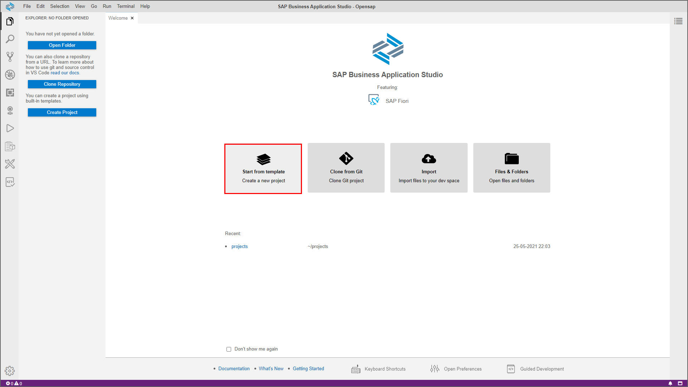


2. Select the template **SAP Fiori application** and click **Start**.

    


3. Select the application type as **Analytical List Page** and click **Next**.

    


4. In this template step we connect to the SAP backend system and select the service which we created in the [Week 1 Unit 5](https://github.wdf.sap.corp/fe-opensap/exercise/week1/unit5.md).

   Choose **Connect to a System** from the dropdown field **Data source**.
    
    
    <br>
    <br>
   To select the system choose **abap-cloud-default_abap-trial(SCP)** from the dropdown field **System** .     

    
    <br>
    <br>
    To select the service choose **ZUI_FE_BOOKING_######_O2(1) - OData V2** from the dropdown field **Service**.

    
   <br>
   <br>

    Click  **Next**.

    


5. In the Entity Selection screen choose **Booking** from the dropdown field **Main entity**.

    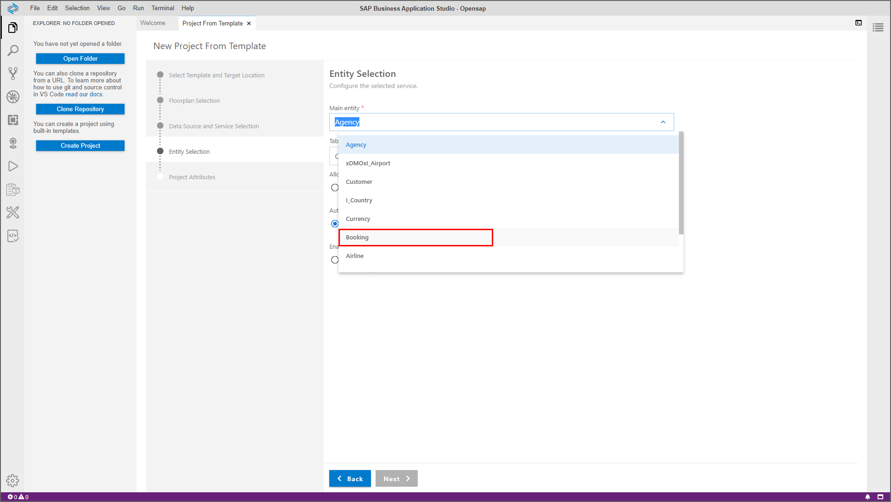
    <br><br>
    **Table type** should be **Analytical**. 

    
   <br><br>
    Click  **Next**.

    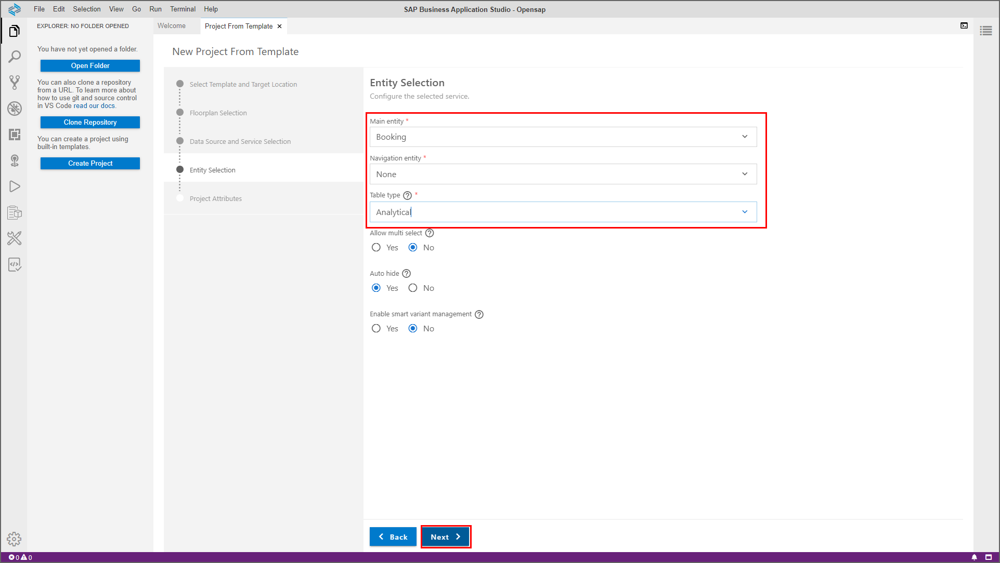


6. Maintain the project attributes as follows:
    
    **Module name**: bookinganalysis
    
    **Application title**: Booking Analysis
    
    **Application Namespace**: sap.fe.demo
   
    **Project folder path**: /home/user/projects

    Click  **Finish**.

    

    The new SAP Fiori elements application is now created from the template using the service and the configurations you provided in this step.


7. Now you can open and display the new application you have created in the folder structure of **Explorer**. To do so click **Open Folder**. 

    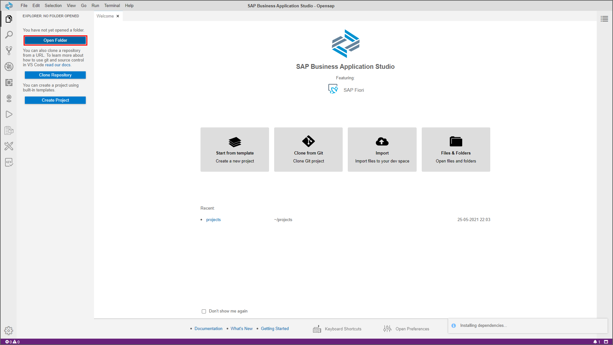
    <br><br>
    Click on  **bookinganalysis**. 

    
    <br><br>
    Click on  **Open**.
   
    
    <br><br>
    In the explorer on the left you can see the newly created application with its folder structure.

    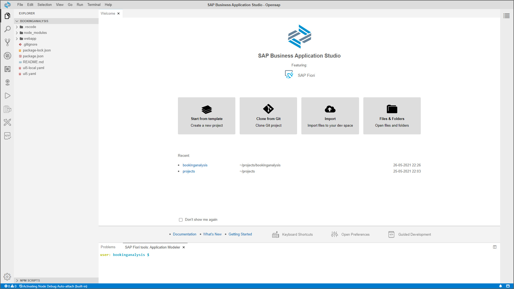


## Step 2. Configuring the content area by adding a table and chart
In this section, you will define the content area of the Analytical List Page with SAP Fiori guided development. 
For this, you first have to open the guided development tool.

1. To open the guided development tool right click on the **Webapp Folder**.

    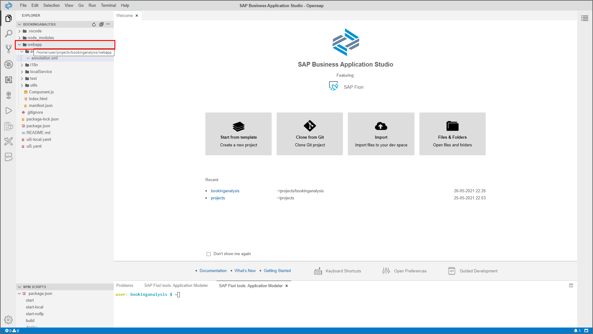


2. Click  **SAP Fiori tools - Open Guided Development**.
    >⚠️ Firefox currently has a bug that it does not treat subdomains of localhost as secure. When you open "Guided Development" or another tool of the Fiori tools and the tab stays empty please refresh the page by pressing F5 or click the reload button of the browser. After reloading the page the tool should show up.
   > 
    

## Step 2.1 Configuring the table by adding columns to it
In this step, you will configure the columns displayed in the table of the Analytical List Page. UI annotation 'LineItem' is used to represent the table, with DataField records representing the columns. As you will use the guided development tool, you do not need to add this annotation manually, just follow the steps below to configure the table, and the respective annotation will be added to or updated in the local annotation file when you choose Insert Snippet (formerly Apply).

1. To find the guides related to tables, type **table** in the search field

    


2. Scroll to the Analytical List Page group and select the guide **Add and edit table columns**.

    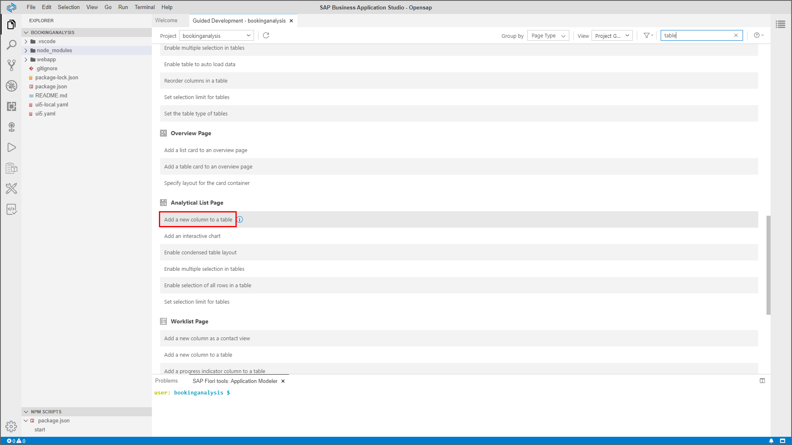


3. Click **Start Guide**.

    

    This simple guide contains just one step adding a column (DataField record) to your table (LineItem). 


4. In the Entity Type field, choose your main entity type as: **BookingType**.

    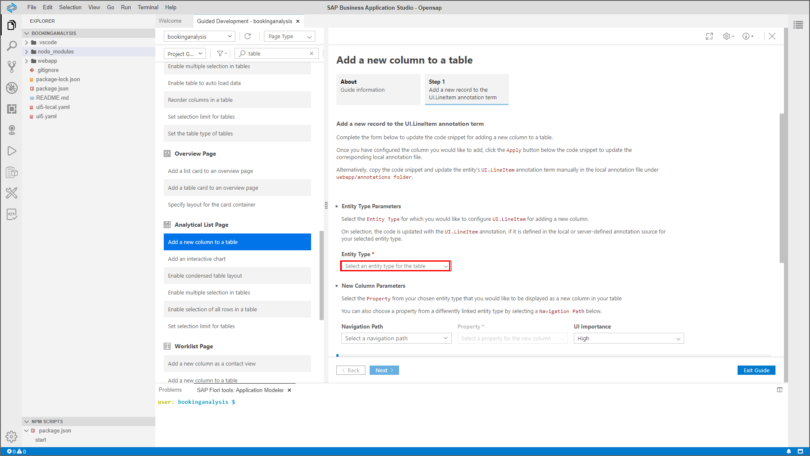

    


5. In the Property field, choose **BookingID** as your first column content. <br>

    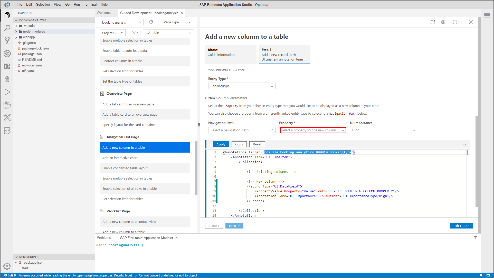

    
    The code snippet is adjusted accordingly. <br>

    Click **Insert Snippet** (by the time the screenshots were created the button was called Apply). <br>
    The annotation UI.LineItem is added to your local annotation file as configured in the code snippet. This file gets opened next to the guided development tool.

    


6. The above step is repeated as many as times as needed to add other columns to the table.

    Choose **AgencyID** and click **Insert Snippet (formerly Apply)**.

    Choose **CustomerID** and click **Insert Snippet (formerly Apply)**.

    Choose **BookingDate** and click **Insert Snippet (formerly Apply)**.

    Choose **FlightDate** and click **Insert Snippet (formerly Apply)**.

    Choose **FlightPrice** and click **Insert Snippet (formerly Apply)**.
    
    Now we can see that the UI.LineItem annotation for all the table columns is added to your local annotation file as shown in the code snippet below.

    ```
   <Annotation Term="UI.LineItem">
        <Collection>
            <Record Type="UI.DataField">
                <PropertyValue Property="Value" Path="BookingID"/>
                <Annotation Term="UI.Importance" EnumMember="UI.ImportanceType/High"/>
            </Record>
            <Record Type="UI.DataField">
                <PropertyValue Property="Value" Path="AgencyID"/>
                <Annotation Term="UI.Importance" EnumMember="UI.ImportanceType/High"/>
            </Record> 
            <Record Type="UI.DataField">
                <PropertyValue Property="Value" Path="CustomerID"/>
                <Annotation Term="UI.Importance" EnumMember="UI.ImportanceType/High"/>
            </Record>
            <Record Type="UI.DataField">
                <PropertyValue Property="Value" Path="BookingDate"/>
                <Annotation Term="UI.Importance" EnumMember="UI.ImportanceType/High"/>
            </Record>
            <Record Type="UI.DataField">
                <PropertyValue Property="Value" Path="FlightDate"/>
                <Annotation Term="UI.Importance" EnumMember="UI.ImportanceType/High"/>
            </Record>
            <Record Type="UI.DataField">
                <PropertyValue Property="Value" Path="FlightPrice"/>
                <Annotation Term="UI.Importance" EnumMember="UI.ImportanceType/High"/>
            </Record>
        </Collection>
   </Annotation>        
    ```

7. When the records for all property are added to your LineItem, click **Exit Guide**  to get back to the list of available guides.

    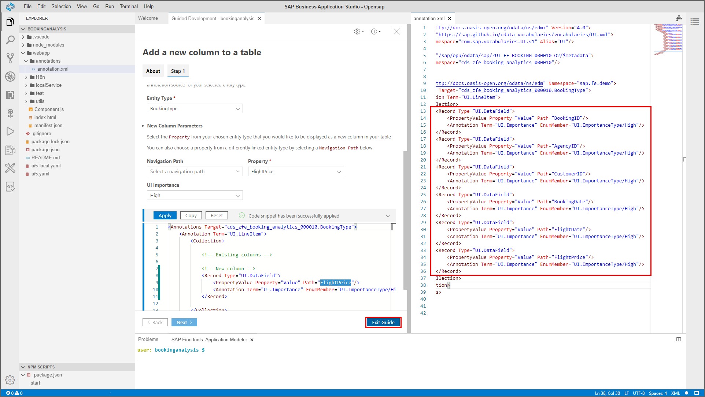


8. Now lets have a look how the app. You can either launch the app like you learned it in week 2, unit 4 or use the context menu to start the preview. Right click on **webapp**.

    


9. Click **Preview Application**.

    


10. Click **Start fiori run —open ‘test/flpSandbox.html#bookinganalysis-tile’**

    

    When the application is loaded click **Go**.

    

    The Analytical list page application is now loaded with the above configured table.

    

## Step 2.2: Configuring the interactive chart

In this step, you will configure the chart to be displayed in the Analytical List Page. As you will use the guided development tool, you do not need to add this annotation manually, just follow the steps below to configure the chart and the respective annotation will be added to or updated in the local annotation file when you choose Insert Snippet (formerly Apply).

1. Filter guides by chart in the search field. 
    Enter **chart** in the search field
    
    


2. Select the guide **Add an interactive chart** in the Analytical List Page group.

    


3. Click **Start Guide**
    
    This guide has 2 steps. In **Step 1** we will be configuring the chart and in **Step 2** the presentation variant for the chart.
    
    


4. Configuring a chart

    In this step, you will configure the annotation term "UI.Chart". It is used to visualize the data in the chart format.
    

5. Select **BookingType** in the dropdown field **Entity Type**.

    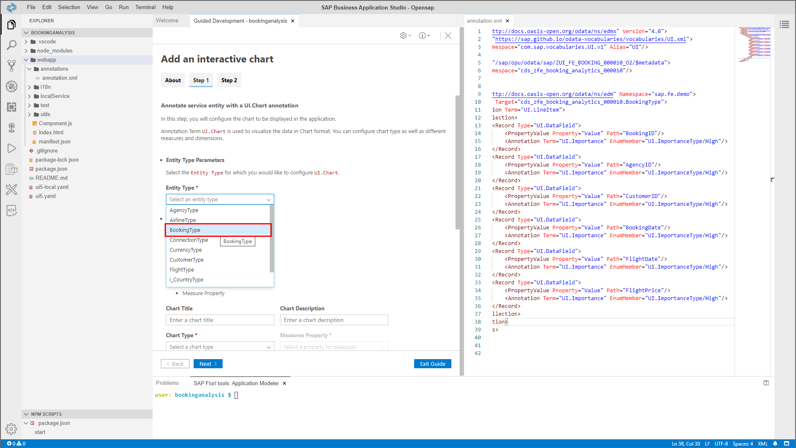


6. Enter the following values in the respective fields

    | **Field**             |**Value**
    | --------------------- |----------------------------------
    | Chart Title           |Booking FlightPrice by CarrierID
    | Chart Description     |Booking FlightPrice by CarrierID
    | ChartType             |Column
    | Measures property     |FlightPrice
    | Dimensions Property   |CarrierID

    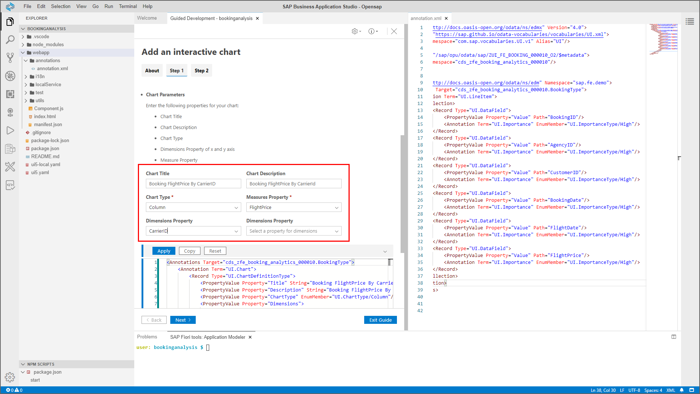


7. Click **Insert Snippet (formerly Apply)**.

    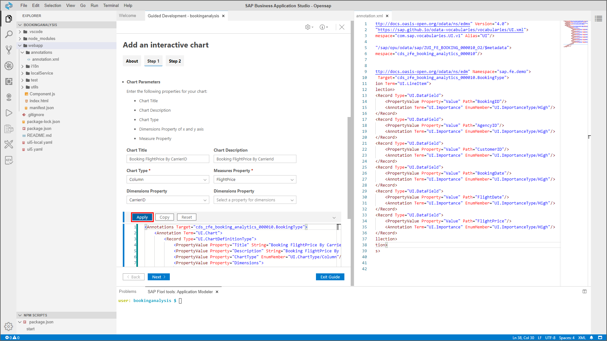


8. Configuring Presentation Variant

    In this step, you will configure a "UI.PresentationVariant" annotation that is used to display the main content of the Analytical List Page. Here you will assign the chart and table created earlier in this exercise as visualization artifacts and define the sorting order. To do so, you will use the **Step 2** of the **Add interactive chart** guide.


9. Click **Step 2** to configure the UI.PresentationVariant annotation term.

    


10. Enter the following values in the respective fields

    |**Field**                 |**Value**
    |------------------------- |----------------------------------
    |Entity Type               |BookingType
    |Sort Order Property       |FlightPrice
    |Sort Order Descending?    |true
    |Include Grand Total?      |false

    


11. Click **Insert Snippet (formerly Apply)**.

    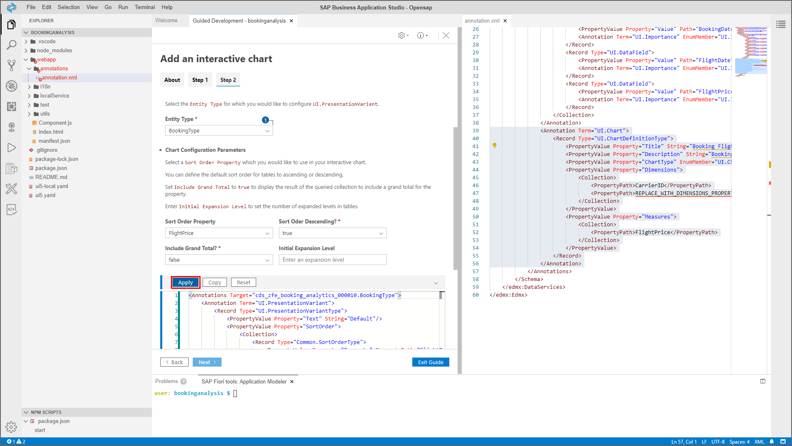

    Now we can see the UI.Chart and UI.PresentationVariant annotation is added to your local annotation file as configured in the code snippet below.

    ```
    <Annotation Term="UI.Chart">
        <Record Type="UI.ChartDefinitionType">
            <PropertyValue Property="Title" String="Booking FlightPrice By CarrierID"/>
            <PropertyValue Property="Description" String="Booking FlightPrice By CarrierID"/>
            <PropertyValue Property="ChartType" EnumMember="UI.ChartType/Column"/>
            <PropertyValue Property="Dimensions">
                <Collection>
                    <PropertyPath>CarrierID</PropertyPath>
                </Collection>
            </PropertyValue>
            <PropertyValue Property="Measures">
                <Collection>
                    <PropertyPath>FlightPrice</PropertyPath>
                </Collection>
            </PropertyValue>
        </Record>
    </Annotation>
    <Annotation Term="UI.PresentationVariant">
        <Record Type="UI.PresentationVariantType">
        <PropertyValue Property="Text" String="Default"/>
             <PropertyValue Property="SortOrder">
                <Collection>
                    <Record Type="Common.SortOrderType">
                        <PropertyValue Property="Property" PropertyPath="FlightPrice"/>
                        <PropertyValue Property="Descending" Bool="true"/>
                    </Record>
                </Collection>
            </PropertyValue>
            <PropertyValue Property="IncludeGrandTotal" Bool="false"/>
            <PropertyValue Property="InitialExpansionLevel" Int="NaN"/>
            <PropertyValue Property="Visualizations">
                <Collection>
                    <AnnotationPath>@UI.LineItem</AnnotationPath>
                    <AnnotationPath>@UI.Chart</AnnotationPath>
                </Collection>
            </PropertyValue>
        </Record>
    </Annotation>

    ```
    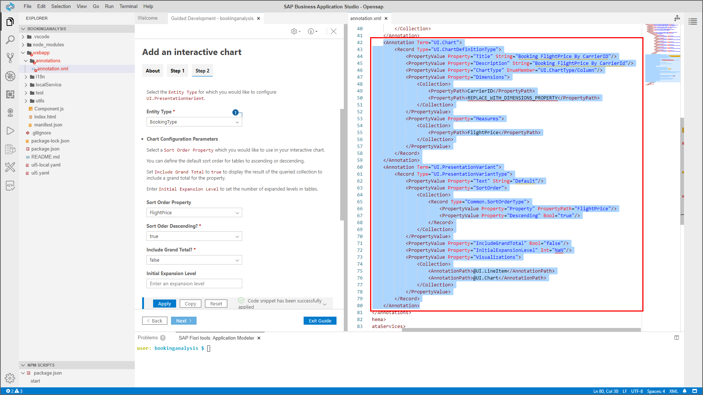


12. Click **Exit Guide**.

    


13. Let's start the preview again. Right click on **webapp** folder.

    


14. Click on **Preview Application**. 

    


15. Click on **Start fiori run —open ‘test/flpSandbox.html#bookinganalysis-tile’**.

    


16. When the application is loaded click on **Go**.

    

    The Analytical List Page application in now displayed with the above configured chart.

    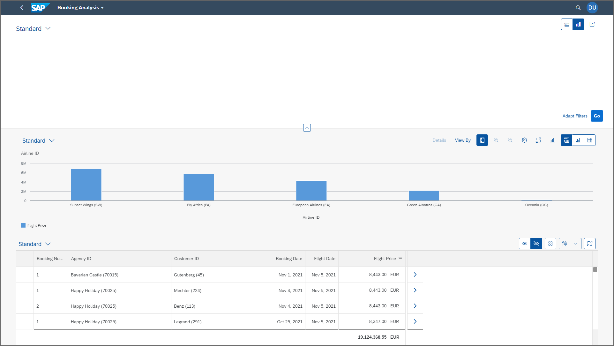

## Summary
You have completed the exercise!

In this unit, you have learned how to

- build an SAP Fiori application based on the Analytical List Page floor plan and 
- configure a table and chart using guided development tool.

## Next Exercise
In the next exercise we will be enhancing this Analytical List Page application by adding filter capabilities.<br/>
[Week 3 Unit 2: Enhancing an Analytical List Page Application](unit2.md)


